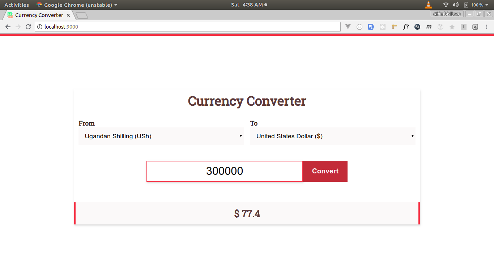

# [Currency Converter](https://krmroland.github.io/currency-converter/)

A simple [Progressive web app](https://developers.google.com/web/progressive-web-apps/) that converts a given amount from one currency to another using [Free Currency Converter API](https://free.currencyconverterapi.com/)

It is an individual project for **[ALC3.0 Mobile Web Specialists](https://andela.com/alcwithgoogle/)** learners whose main purpose is to

*   Determine your overall progress in the ALC program, and identify the top 100 learners
    from the track
*   To test the skills learned by learners and certify the top learners at the end of the
    program.

## Demo

A working demo can be found [here](https://krmroland.github.io/currency-converter/). Thanks to [github pages](https://pages.github.com/)

## Notes

*   The app uses [webpack](https://webpack.js.org/) for module bundling and **`es6 modules`** for code modularity whose native support in browsers is still relatively low compared to other **`es6 features`** .

*   It doesn't use any trans-pilers meaning that it will only work in browsers that support **`es6 features`** and above .

*   Its doesn't use any `javascript frameworks` and is only built with the native browser [DOM APIs](https://developer.mozilla.org/en-US/docs/Web/API/Document_Object_Model) .

*   It only uses the [Cache Interface](https://developer.mozilla.org/en-US/docs/Web/API/Cache) for handling all the off line data. This is because most of the assets used by this app are static or rarely change **(currency Ids & symbols)** and those that change **(conversion rates)**, change frequently **(every one hour )** .

## Prerequisite

Ensure that you have the following tools available on your machine

*   [Node js](https://nodejs.org/en/), a JavaScript runtime built on Chrome's V8 JavaScript engine.
*   [A package manager](https://en.wikipedia.org/wiki/Package_manager) like [npm](https://www.npmjs.com/) or [yarn](https://yarnpkg.com/lang/en/) for installing dependencies like `webpack`
*   [Git](https://git-scm.com/) , a Version Control System

## Getting Started

1.  Clone the repo locally to your machine `git clone https://github.com/krmroland/currency-converter.git`

2.  In your `terminal` change your current directory (`cd`) to wherever you `cloned` the app in 1 above.

## Installation

While in your terminal;

*   Install its dependencies by running `yarn` or `npm install` depending on the package manager you installed
*   Run `npm run watch` or `yarn watch` to compile, and recompile whenever a change is made.

*   Run `npm run build` or `yarn build` to minimize and compile the code for production

_**NB:** The compiled code is located in the `/dist` directory and it is cleaned on every build so all the assets should be put in the `/public` directory since the build script will copy them to the `/dist` directory on every build_

## Credits

A Special thanks goes to [Andela Learning Community](https://andela.com/alcwithgoogle/), without them , this application wouldn't be a success
